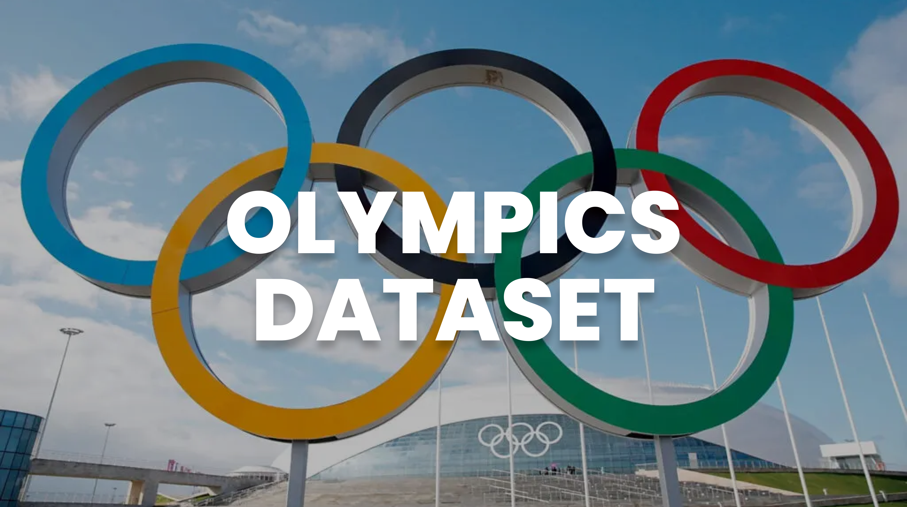
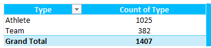
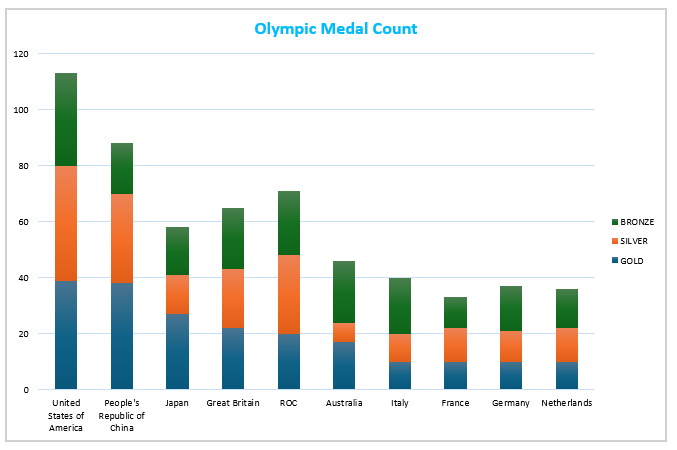

Banner [source](https://graphicsprings.com/blog/view/olympic-logo/)

Badge [source](https://shields.io/)

# Key findings: Olympics Dataset (Beijing 2022 and Tokyo 2020): Type, Discpline, Medal Count, Slicer

<!-- Authors -->
<!-- ## Reference
- Learn 80% of Data Analysis in Excel in Just 12 Minutes ( https://www.youtube.com/watch?v=O1QfG5SXRkM) -->

## Table of Contents

  - [Olympics Dataset (Beijing 2022 and Tokyo 2020): Type, Discpline, Medal Count, Slicer](#olympics-dataset-(beijing-2022-and-tokyo-2020):-type-discpline-medal-count-slicer)
  <!-- - [Reference](#reference) -->
  - [Table of Contents](#table-of-contents)
  - [Business Problem](#business-problem)
  - [Data source](#data-source)
  - [Methods](#methods) 
  - [Tech Stack](#tech-stack)
  - [Summary of Key Results](#summary-of-key-results)
  
## Business Problem
This project focuses on key steps in the Data Analysis process: Cleaning, Transforming, Analyzing, and Visualizing data, using the Olympics Datasets from Tokyo 2020 and Beijing 2022.

The goal is to demonstrate how to work with real-world datasets by:

• Cleaning the data: removing duplicates and handling inconsistencies.

• Transforming the data: identifying and replacing specific terminologies to standardize the dataset.

• Analyzing the data: creating pivot tables to categorize by event type, discipline, and medals earned, as well as implementing slicers to group and filter results.

• Visualizing the results: generating charts to represent medal counts for better insights.

This workflow exemplifies the essential skills needed in Data Analysis, enabling more informed and insightful decisions based on data.

## Data Source

- Learn 80% of Data Analysis in Excel in Just 12 Minutes ( https://www.youtube.com/watch?v=O1QfG5SXRkM)

## Methods

- Data Cleaning
- Data Transformation
- Pivot Table Analysis
- Data Visualization 

## Tech Stack

- Microsoft Excel
    - Data Cleaning (Remove Duplicates)
    - Formulas & Functions
    - Pivot Tables
    - Filter
    - Charting & Data Visualization

## Summary of Key Results

Athlete vs. Team Participation Count

Discipline Distribution with Count and Percentage

Olympic Medal Count by Country (Beijing 2022 & Tokyo 2020) with Game Filter

Stacked Chart Medal Count by Country (Gold, Silver, Bronze)

